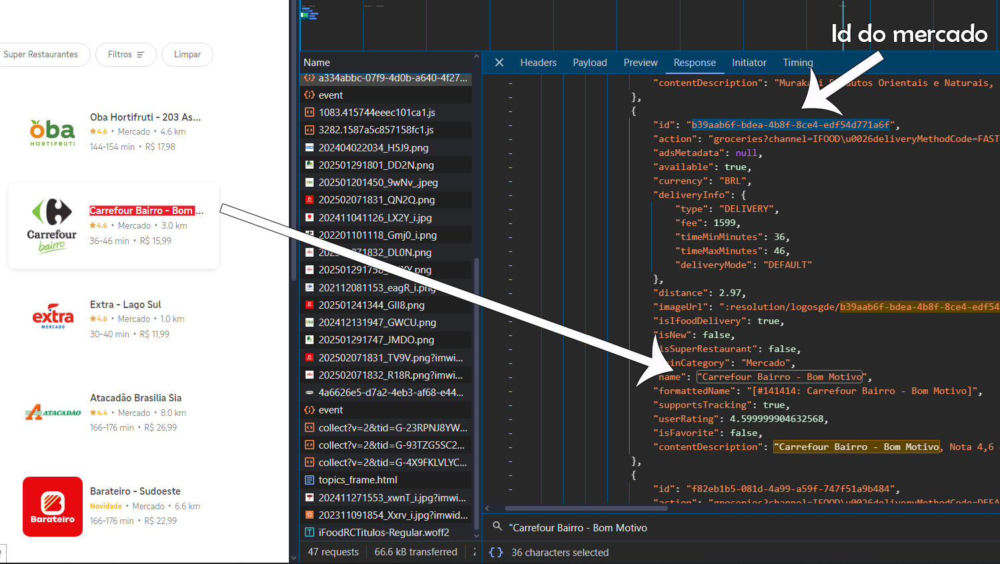
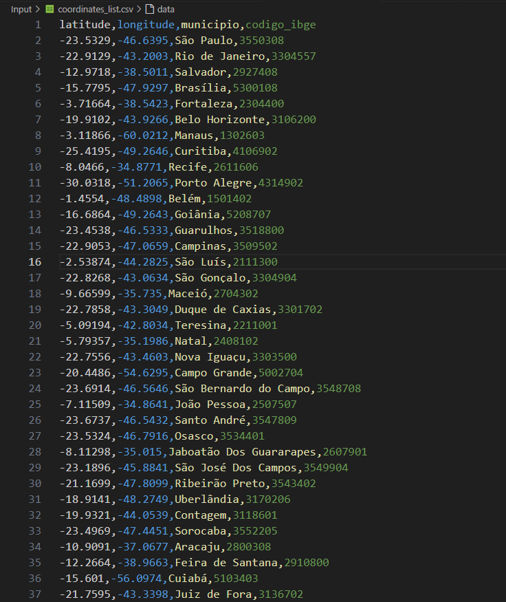
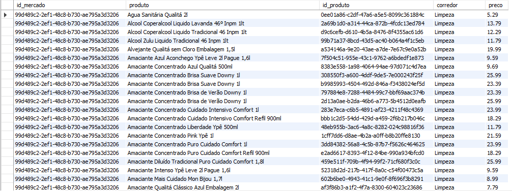
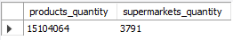
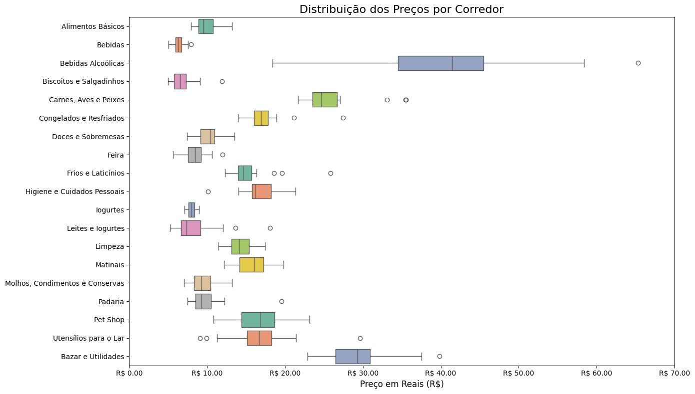
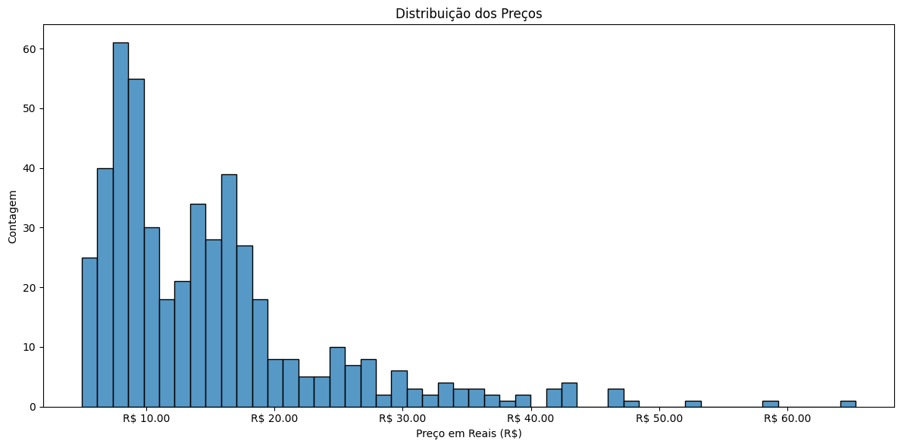
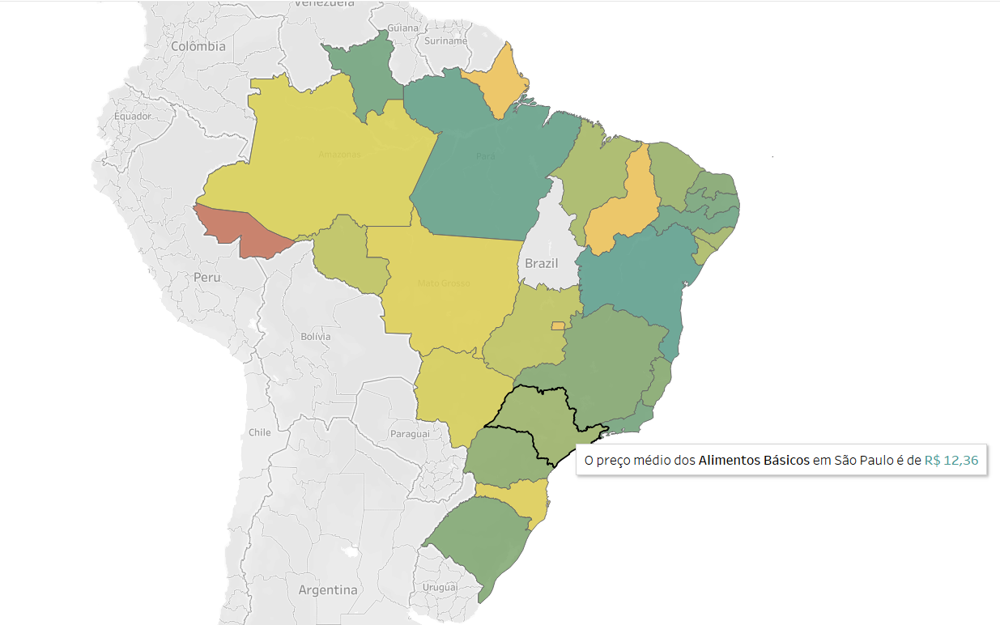
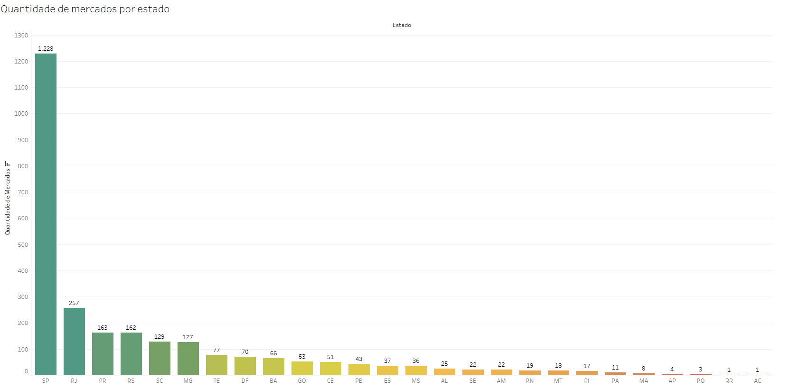

# 🛒 Análise de Preços no iFood - Projeto de Ciência de Dados  

Este repositório documenta meu projeto de análise de preços de supermercados no iFood. Desde a coleta e o processamento dos dados até a análise e visualização, utilizei web scraping, técnicas de ETL, bancos de dados e ferramentas de visualização de dados.  

---

## 📌 1. Introdução  

### 🎯 Objetivo  
O objetivo deste projeto foi analisar os preços dos produtos vendidos em supermercados pelo iFood, o maior aplicativo de delivery do Brasil. Para isso, utilizei técnicas de web scraping para coletar dados diretamente da plataforma, realizei o processamento dos dados e criei visualizações informativas.  

### 🚀 Tecnologias Utilizadas  
- **Python** (requests, pandas, matplotlib, SQLAlchemy, etc.)  
- **MySQL** (armazenamento de dados)  
- **AWS** (banco de dados na nuvem)  
- **Tableau** (visualização de dados)  

---

## 🔍 2. Coleta de Dados  

### 🕵️‍♂️ 2.1. Como o iFood Funciona  

Para entender como o iFood exibe os supermercados e produtos, utilizei a ferramenta **Inspecionar Elemento** no navegador (aba **Network**) para encontrar as APIs usadas pelo site.  

✅ **Principais Descobertas:**  
- O iFood utiliza **Google Maps** para converter endereços em coordenadas.  
- O site exibe supermercados disponíveis com base na distância do cliente e nas preferências do mercado.  
- Cada supermercado possui um **ID único**.  

🖼️ **Inspecionando o site do iFood**  
  

---

### 🌎 2.2. Obtendo Coordenadas  

Para acessar supermercados em todo o Brasil, precisei de coordenadas para todas as cidades. Cidades maiores exigiram múltiplas coordenadas.  

📂 **Resultado:**  
- Um arquivo CSV com **7267 linhas**, cobrindo grande parte do Brasil.  

🖼️ **Arquivo CSV com coordenadas**  
  

---

## ⚙️ 3. Extração e Processamento dos Dados  

Após enviar as coordenadas para o iFood, recebi listas de supermercados e coletei os produtos vendidos por cada um.  

❗ **Desafios:**  
- A resposta da API continha **tags desatualizadas e irrelevantes**.  
- Usei técnicas de **data mining e ETL** para limpar os dados.  

✅ **Resultado:**  
- Dados organizados incluindo:  
  - **Nome do produto**  
  - **Categoria (corredor)**  
  - **Preço**  
  - **ID do supermercado**  

🖼️ **Dados brutos vs. processados**  
  

---

## 🗄️ 4. Armazenamento no Banco de Dados  

Armazenei os dados no **MySQL**, tanto localmente quanto na **AWS**.  

📊 **Estatísticas do Banco de Dados:**  
- **Mais de 15 milhões de linhas** coletadas.  
- **3791 supermercados** registrados.  

🖼️ **Banco de Dados**  
  

---

## 📊 5. Visualização dos Dados  

Utilizei **Python e Tableau** para criar gráficos e entender a distribuição dos preços.  

🖼️ **Exemplos de visualizações criadas**  
  
  
  
  

Como podemos ver no último gráfico, diversos estados têm poucos supermercados disponíveis no iFood, tornando impossível analisar a média de preços verdadeira nesses mercados usando apenas os dados do iFood. Por isso, estou desenvolvendo uma forma de conseguir mais supermercados nesses estados, provavelmente utilizando os sites oficiais dos supermercados. Isso também permitirá comparar os preços disponíveis no iFood com os encontrados nesses sites.  

---

## 🎯 6. Conclusão  

Este projeto demonstrou técnicas de **web scraping, ETL, gerenciamento de banco de dados e visualização de dados** para analisar preços no iFood.  

🚀 **Melhorias futuras:**  
- Automatizar a atualização dos dados.  
- Encontrar novas fontes para obter mais supermercados.  
- Aplicar machine learning para prever preços.  
